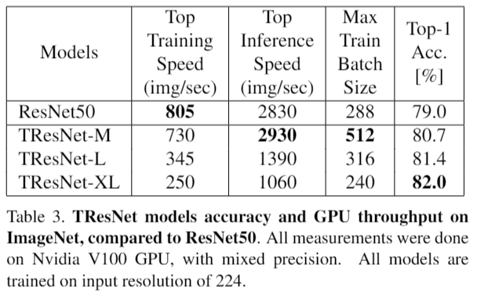
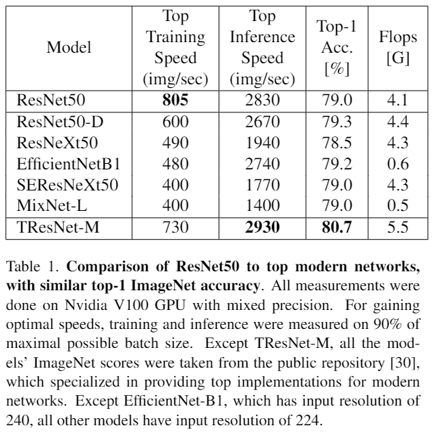
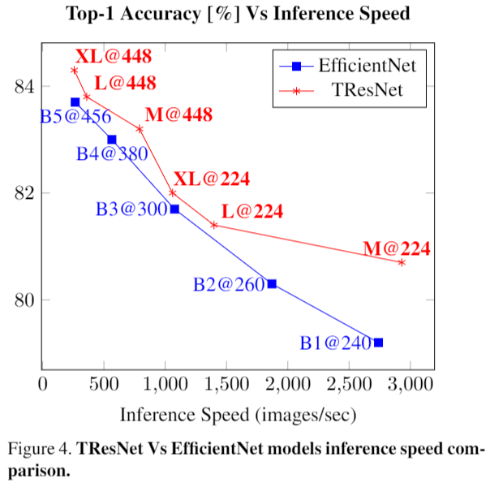
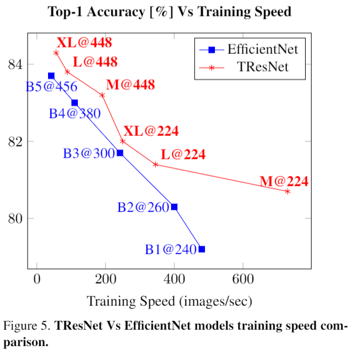
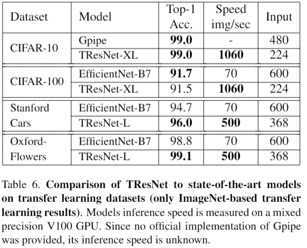

# TResNet: High Performance GPU-Dedicated Architecture


[paper](TBD) | [pretrained models](https://drive.google.com/open?id=1a4GqqQ24J3ct8WkOM6t0DqmX3BlkhUwC) 

Official PyTorch Implementation

> Tal Ridnik, Hussam Lawen, Asaf Noy, Itamar Friedman <br/>
> DAMO Academy, Alibaba Group


**Abstract**

> Many deep learning models, developed in recent years, reach higher
> ImageNet accuracy than ResNet50, with fewer or comparable FLOPS count.
> While FLOPs are often seen as a proxy for network efficiency, when
> measuring actual GPU training and inference throughput, vanilla
> ResNet50 is usually significantly faster than its recent competitors,
> offering better throughput-accuracy trade-off. In this work, we
> introduce a series of architecture modifications that aim to boost
> neural networks' accuracy, while retaining their GPU training and
> inference efficiency. We first demonstrate and discuss the bottlenecks
> induced by FLOPs-optimizations. We then suggest alternative designs
> that better utilize GPU structure and assets. Finally, we introduce a
> new family of GPU-dedicated models, called TResNet, which achieve
> better accuracy and efficiency than previous ConvNets. Using a TResNet
> model, with similar GPU throughput to ResNet50, we reach 80.7\%
> top-1 accuracy on ImageNet. Our TResNet models also transfer well and
> achieve state-of-the-art accuracy on competitive datasets such as
> Stanford cars (96.0\%), CIFAR-10 (99.0\%), CIFAR-100 (91.5\%) and
> Oxford-Flowers (99.1\%)
## Main Results
#### TResNet Models
<p align="center">
 
</p>

#### Comparison To Other Networks
<p align="center">
 
</p>
 <br/>
<p align="center">
 <br/>
 
</p>

#### Transfer Learning SotA Results
<p align="center">
 
</p>


## Reproduce Results
We provide code for reproducing the validation top-1 score of TResNet
models on ImageNet, input resolution 224. First, download pretrained 
models from
[here](https://drive.google.com/open?id=1a4GqqQ24J3ct8WkOM6t0DqmX3BlkhUwC).

Then, run the infer.py script. For example, for tresnet_m run:
```bash
python -m infer.py \
--val_dir=/path/to/imagenet_val_folder
--model_path=/model/path/to/tresnet_m.pth
--model_name=tresnet_m
```

## Citation

```
@misc{TBD}
}
```

## Contact
Feel free to contact me if there are any questions or issues (Tal
Ridnik, tal.ridnik@alibaba-inc.com).